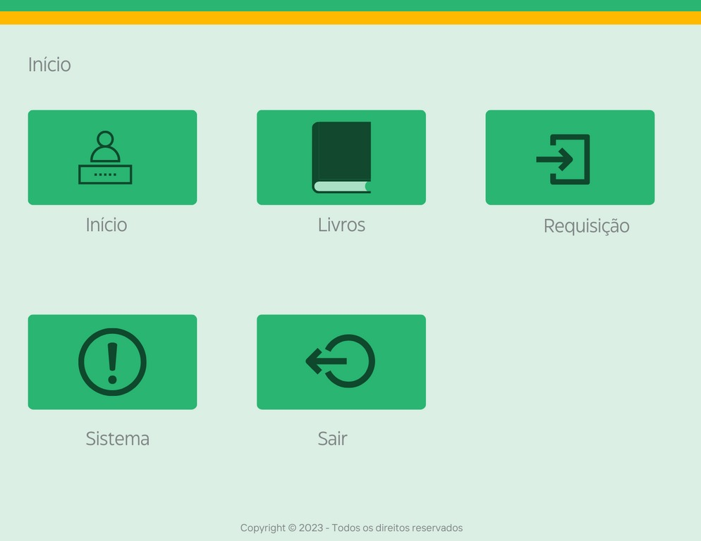
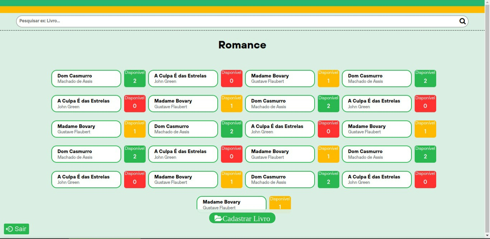
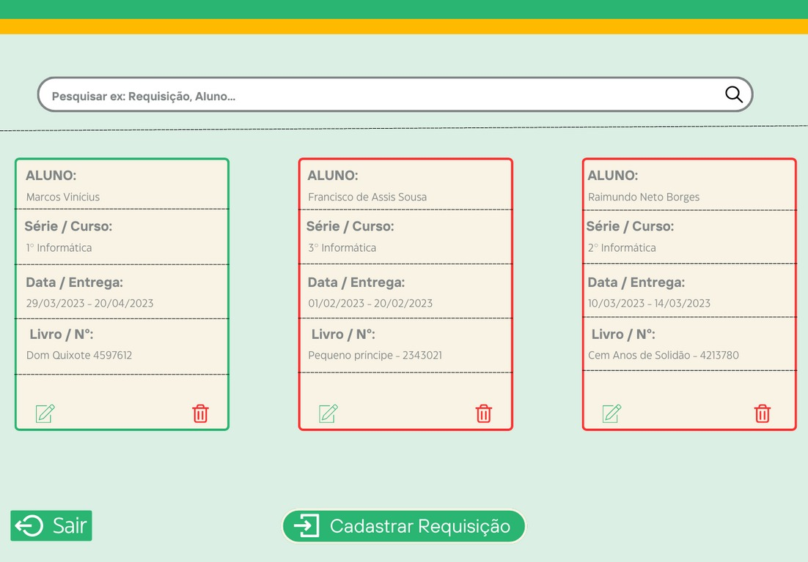
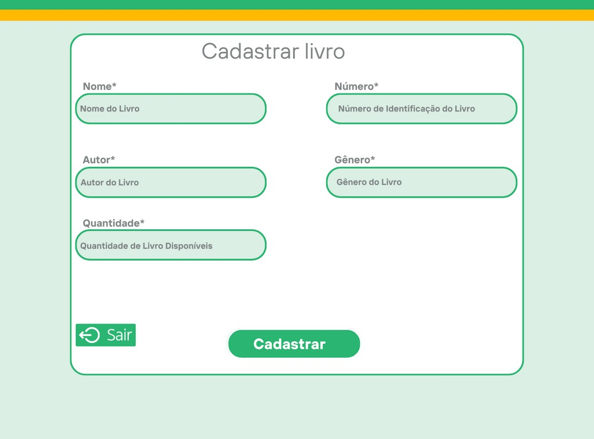
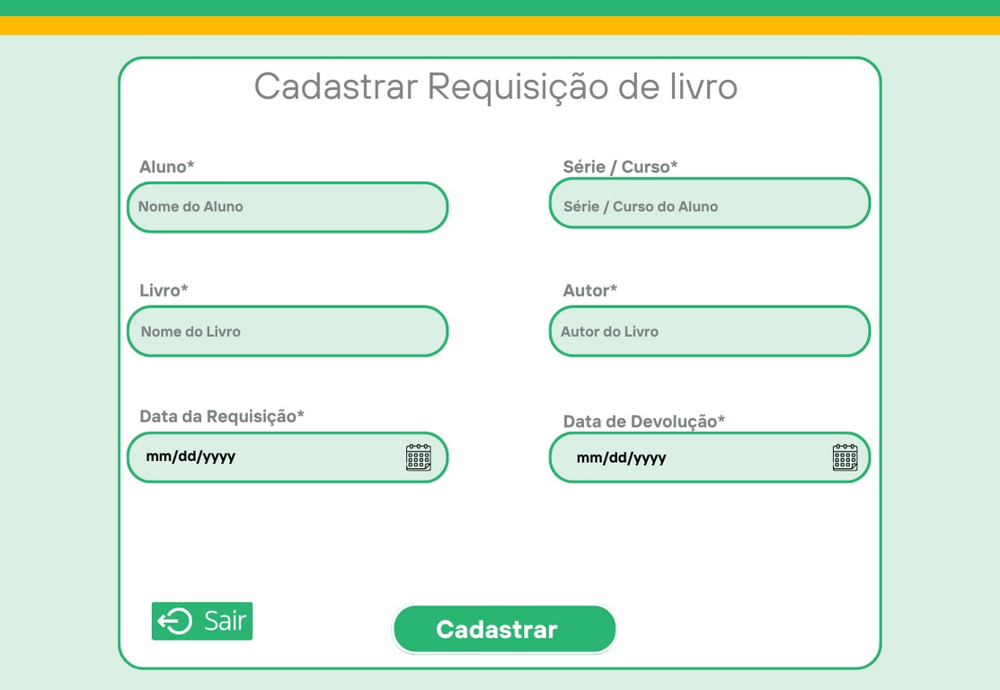

<h1 align="center">SIBI - Gerardo José</h1>

SIBI - Gerardo José: é um sistema de uso administrativo para bibliotecas

 

  

  

  

  

  

  

## 🚀 Tecnologias

Esse projeto foi desenvolvido com as seguintes tecnologias:

- Php
- MYSQL 
- HTML
- CSS
- Javascript 
- Git e Github

## 💻 Projeto

SIBI - Gerardo José, é um sistema desenvolvido com o intuito de facilitar toda administração de uma biblioteca, por meio virtual.
